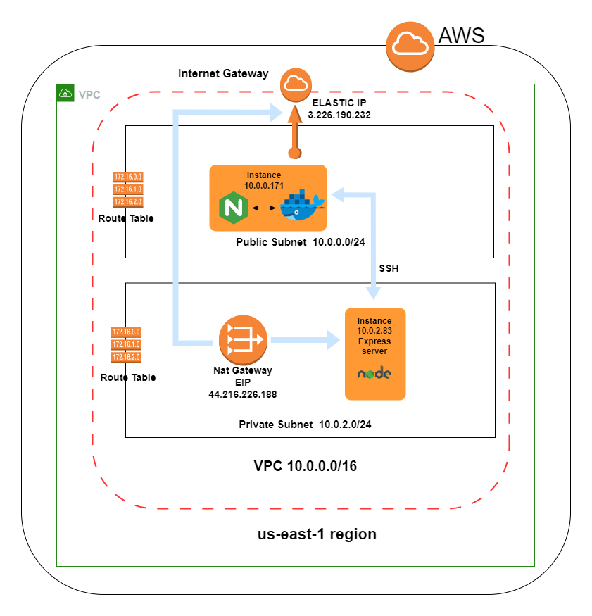

<a name="readme-top"></a>


<div align="center">
  
  
  <br/>

  <h3><b>Deploying Hybrid SSR-SPA App on AWS Using Bash Script Automation </b></h3>

</div>

<!-- TABLE OF CONTENTS -->

# 📗 Table of Contents

- [📖 About the Project](#about-project)
  - [🛠 Built With](#built-with)
    - [Tech Stack](#tech-stack)
    - [Key Features](#key-features)
  - [🚀 Live Demo](#live-demo)
- [💻 Getting Started](#getting-started)
  - [Setup](#setup)
  - [Prerequisites](#prerequisites)
  - [Install](#install)
  - [Usage](#usage)
  - [Run tests](#run-tests)
  - [Deployment](#deployment)
- [👥 Authors](#authors)
- [🔭 Future Features](#future-features)
- [🤝 Contributing](#contributing)
- [⭐️ Show your support](#support)
- [🙏 Acknowledgements](#acknowledgements)
- [❓ FAQ (OPTIONAL)](#faq)
- [📝 License](#license)


<!-- PROJECT DESCRIPTION -->

# 📖 [SPA-SSR, DOCKER, NGINX, OPENSSL, BASH  & AWS ] <a name="about-project"></a>

  **[SPA-SSR, DOCKER, NGINX, OPENSSL, BASH  & AWS]**  This repository provides an example of how to deploy a JavaScript Single Page Application which was built using  plain JavaScript, Webpack and Express.
  The main goal is to show how to deploy SPA-SSR application on AWS without relying on any GitOps methodology. The idea is to demonstrate an alternative approach to application deployment that is not dependent on any configuration management tool, infrastructure automation tool, or CI/CD pipeline.
   

### Tech Stack <a name="tech-stack"></a>

<li> HTML </li>
<li> CSS </li>
<li> Javascript </li>
<li> Webpack </li>
<li> Express </li>
<li> Docker Compose </li>
<li> OpenSSL </li>
<li> github actions  </li>
<li> Bash Script </li>
<li> AWS EC2 Instances,VPC, ROUTE TABLE, SECURITY GROUP , NAT GATEWAY, INTERNET GATEWAY </li>


<!-- Features -->

### Key Features <a name="key-features"></a>


- **[SPA Architecture]**
- **[Server-Side Menu Rendering]**
- **[ES6 Modules]**
- **[Webpack Bundling ]**
- **[Express Server to handle routing]**
- **[Docker Integration]**
- **[Nginx Configuration]**
- **[OpenSSL Configuation]**
- **[AWS EC2 Instances Deploy]**


### Features

## SPA Architecture:
 The project showcases the implementation of a Single Page Application using Webpack and Express.

## Server-Side Menu Rendering: 
Express is configured to dynamically render menu paths on the server side, eliminating the need for full page reloads when navigating between menu items. The menu filters the max supply, low supply and profile cards of each cryptocurrency.

## Webpack Integration: 
The project employs Webpack for bundling and optimizing client-side assets, resulting in a performant and efficient front-end.

## Docker Integration: 
The project utilizes Docker Compose to  build and  run the application to AWS EC2 instances.

## Nginx Configuation: 
 Nginx as a reverse proxy to route requests through express  to serve static assets.
<p align="right">(<a href="#readme-top">back to top</a>)</p>

## Bash Script Deployment: 
The project uses a bash scrit to automate the deployment of the application to AWS EC2 instances.

## OpenSSL Configuation: 
The project utilizes OpenSSL to generate a self-signed certificate for Nginx.

## AWS EC2 Instances Deploy: 
The project deploys the application  into an AWS EC2 instance.


<!-- LIVE DEMO -->

### 🚀 Live Demo <a name="live-demo"></a>

> 

- [Live Demo Link](	https://google.com)


<p align="right">(<a href="#readme-top">back to top</a>)</p>
<!-- GETTING STARTED -->

## 💻 Getting Started <a name="getting-started"></a>


To get a local copy up and running, follow these steps.

### Prerequisites
To run this project  you need the following tools installed:

- [Git and GitHub ]
- [Webpack ]
- [Express ]
- [Docker ]
- [Docker Compose ]
- [OpenSSL ]
- [Bash Script ]
- [Nginx ]
- [AWS EC2 Instances ]


### Setup

Clone this repository to your desired folder:
```sh
 cd deploy-SPA-DockerCompose
 git clone git@github.com:alyconr/deploy-SPA-DockerCompose
```


### Install

Install this project with:

```sh
 cd deploy-SPA-DockerCompose
 npm install
```

### Usage

To run locally run the following command:
## Development mode
```sh
    npm run build-dev
    npm run devserver-reload    
```
## Production mode

```sh
    npm run build-prod
    npm run server-prod
```


### Run tests

To run tests, run the following command:


To test the Stylelint linter:
```sh
    npx stylelint "**/*.{css,scss}"
```
To test the Webhint:
```sh
    npx hint .
```
To test the ESLint linter:
```sh
    npx eslint .
```


### Deployment

 The image below shows the arquitecture with all the resources configured:
<div align= "center">
 
</div>

Run the following command to install the necessary dependencies from the bash script file:

```sh
    bash installpackages.sh -u $USER -i $IP_PUBLIC_SERVER -s $IP_PRIVATE_SERVER
```

Run the following command to deploy the project to AWS EC2 instances:

```sh
     bash deployment.sh  -u $USER  -i $IP_PUBLIC_SERVER -s $IP_PRIVATE_SERVER -d $APP_FOLDER -f $EXPRESS_FOLDER -e prod 
```

<p align="right">(<a href="#readme-top">back to top</a>)</p>

<!-- AUTHORS -->

## 👥 Authors <a name="authors"></a>

JEYSSON CONTRERAS


👤 **Author1**

- GitHub: [@alyconr](https://github.com/alyconr)
- LinkedIn: [LinkedIn](https://www.linkedin.com/in/jeysson-aly-contreras/)


<p align="right">(<a href="#readme-top">back to top</a>)</p>

<!-- FUTURE FEATURES -->

## 🔭 Future Features <a name="future-features"></a>


- [ ] **[kubernetes deployment]**
- [ ] **[CloudForm deployment]**


<p align="right">(<a href="#readme-top">back to top</a>)</p>

<!-- CONTRIBUTING -->

## 🤝 Contributing <a name="contributing"></a>

Contributions, issues, and feature requests are welcome!

Feel free to check the [issues page](https://github.com/alyconr/deploy-SPA-DockerCompose.git/issues).

<p align="right">(<a href="#readme-top">back to top</a>)</p>

<!-- SUPPORT -->

## ⭐️ Show your support <a name="support"></a>

> Write a message to encourage readers to support your project

If you like this project please give  one start.

<p align="right">(<a href="#readme-top">back to top</a>)</p>

<!-- ACKNOWLEDGEMENTS -->

## 🙏 Acknowledgments <a name="acknowledgements"></a>

I would like to thank  God for giving me the strength to carry out this project.
<p align="right">(<a href="#readme-top">back to top</a>)</p>

<!-- FAQ (optional) -->


<p align="right">(<a href="#readme-top">back to top</a>)</p>

<!-- LICENSE -->

## 📝 License <a name="license"></a>

This project is [MIT](LICENSE.md) licensed.


<p align="right">(<a href="#readme-top">back to top</a>)</p>
